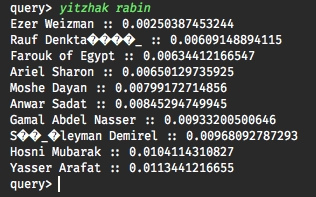

Part of the [TL;DR of the World](https://tlderofthe.world) academic project

# Graphy
Utility for exploring and building graphs of data over the pantheon dataset

### Abstract

Graphy is a set of tools which are used for creating a weighted, directed graph that represents "personality" distances between people. This toolset was used by us in order to investigate and tamper with data describing famous people from across time and all over the world, to best suit our project.

Built on top of the [pantheon](http://pantheon.media.mit.edu/) dataset, graphy aims to create a graph that should help find people with some similarity to a given set of people - that is, to aid with "suggesting" which people one should be following, for a given set of people that he already is.

### Implementation

Graphy has three tools implemented:

**Graphy Generator**

The generator is a utility that, given a `pantheon.csv` dataset and a calculator class (see [documentation](https://github.com/illBeRoy/famous-quote-feed-data-explorer/blob/master/generator.py)), generates a proximity graph and exports it as a `pickle` file, so it could be used by other utils or the server itself.

**Graphy Trimmer**

The trimmer is a utility that, given a `graph.pickle` file, trims each vertex to have a cap over the amount outgoing edges. see [documentation](https://github.com/illBeRoy/famous-quote-feed-data-explorer/blob/master/trimmer.py)

**Graphy Explorer**

The explorer is a utility that interactively allows a user to explore a given graph, that is: make queries over it, in order to see which edges are the top selections for each input. see [documentation](https://github.com/illBeRoy/famous-quote-feed-data-explorer/blob/master/explorer.py)

### Usage

After cloning the repository and installing the required dependencies, you will have to first use the generator in order to generate a proximity graph - refer to the docs in order to see how to achieve that. After that, you'll be able to explore your graph using the explorer, or trim it using the trimmer, if it is working too slowly.

### Example of the output

The following output was queried using the `explorer` util over a graph built with the `time and space` calculator:

### Note

With English being our second language, we've mistakenly referred to 'edges' as 'vertices' and vice versa. Just switch them in you mind.

The file final.openrefine.tar.gz contains all the info on the people we use in the site, that means it contains the info taken from pantheon and mapping of people to their wikiquote and wikipedia page names.
